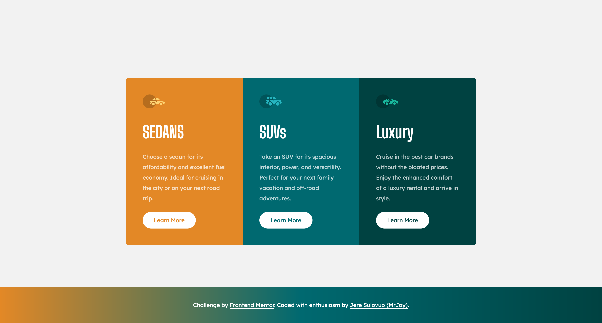

# Frontend Mentor - 3-column preview card component solution

This is MrJay's solution to the [3-column preview card component challenge on Frontend Mentor](https://www.frontendmentor.io/challenges/3column-preview-card-component-pH92eAR2-).

## Table of contents

- [Overview](#overview)
  - [The challenge](#the-challenge)
  - [Screenshot](#screenshot)
  - [Links](#links)
- [My process](#my-process)
  - [Built with](#built-with)
  - [Continued development](#continued-development)
- [Author](#author)

**Note: Delete this note and update the table of contents based on what sections you keep.**

## Overview

### The challenge

Users should be able to:

- View the optimal layout depending on their device's screen size
- See hover states for interactive elements

### Screenshot



### Links

- Solution URL: [Github](https://github.com/jeresulovuo/3-column-preview-card-component)
- Live Site URL: [Vercel](https://mrjays-3-column-preview-card-component.vercel.app/)

## My process
Starting with mobile first approach, I analyse both the designs in mobile and desktop view. By doing, I can understand the structure better and design a layout that suits adjusts according in both mobile and desktop.

Since this is a small component, all the code will be done in one file (except the footer component).
The strcuture of all the content can be easily be implemented via flex.
- Desktop view, the container will be flex-row.
- Mobile view, the container will be flex-col. 
- The content of the cards will be flex-col.

### Built with

- Semantic HTML5 markup
- Flexbox
- Mobile-first workflow
- [TailwindCSS](https://tailwindcss.com/)
- [React](https://reactjs.org/) - JS library
- [Next.js](https://nextjs.org/) - React framework

### What I learned

This project was used so I can better learn to add custom css variables such as colors and font to tailwind. I learned how to better code custom variables via tailwind.config.js such as:

```tailwind.config.js
 theme: {
        extend: {
            fontFamily: {
                inter: ['var(--font-inter)'],
                'big-shoulders-display': ['var(--font-big-shoulders-display)'],
              },
            colors: {
                // Primary
                'Bright-orange': 'hsl(31, 77%, 52%)',
                'Dark-cyan': 'hsl(184, 100%, 22%)',
                'Very-dark-cyan': 'hsl(179, 100%, 13%)',

                // Neutral
                'Transparent-white': 'hsla(0, 0%, 100%, 0.75)',
                'Very-light-gray': 'hsl(0, 0%, 95%)'
            }
        },
    },
```

```layout.tsx
import { Inter, Lexend_Deca, Big_Shoulders_Display } from 'next/font/google'

const inter = Inter({ subsets: ['latin'], variable: '--font-inter' })

const bigShouldersDisplay = Big_Shoulders_Display({
  weight: ['400', '700'],
  style: ['normal'],
  subsets: ['latin'],
  display: 'swap',
  variable: '--font-big-shoulders-display'
})

const lexendDeca = Lexend_Deca({
  subsets: ['latin'],
  weight: ['400'],
  style: ['normal'],
  display: 'swap',
  variable: '--font-lexend-deca'
})

export const metadata: Metadata = {
  title: 'Frontend Mentor | 3-column preview card component',
  description: 'Challenge from Frontend Mentor',
}

export default function RootLayout({
  children,
}: {
  children: React.ReactNode
}) {
  return (
    <html lang="en">
      <body className={`${inter.variable} ${lexendDeca.className} ${bigShouldersDisplay.variable} `}>{children}</body>
    </html>
  )
}
```

## Author

- Website - [MrJay's Simple Portfolio](https://mrjays-simple-portfolio.vercel.app/)
- Github - [Jere / Chung Vui Loong](https://github.com/chungvuiloong)